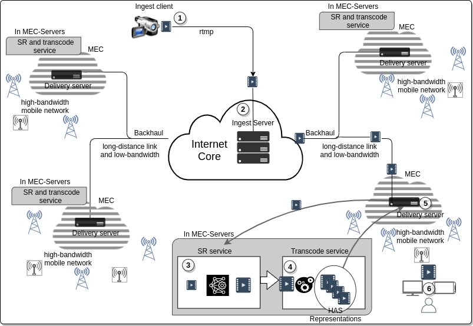
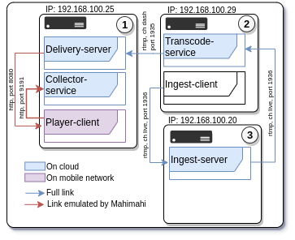

# LiveSR

LiveSR is an environment for experimenting with scientific studies on video delivery over the internet.
Currently, the environment consists of the following modules and services:

* Ingest Server: RTMP server module that receives the transmission from the Ingest Client. We use the stable version of NGINX (1.20.0) compiled with the RTMP module.     
* SR Service: this module is responsible for scaling the video from low to high resolution, it is located in the MEC, and can be in a different server from the Delivery Server, as long as it has a high-speed and low-latency interconnection with it. The SR server makes use of GPU so that the inference is in real time. 
* Transcode Service: after scaled by SR, the video in high resolution is sent to the transcoding module to be transcoded into HAS format, in the LiveSR framework, it is possible to transcode to DASH and HLS standards. The transcoding is performed by the FFmpeg tool (version 4.3.1) integrated into NGINX with the RTMP module enhanced for DASH.
* Delivery Server: For this module, the NGINX tool (1.20.0) was used as the HTTP server. After the video is transcoded, the streaming definition files, MPD and/or M3U8, are available to the viewers through the Delivery Server. Also on the Delivery Server is the main web page that provides access to the dash.js player, which is configured to use three distinct ABR algorithms, BOLA, LoL+ and L2A-LL. The page that serves the video has a javascript component that, for each established video session, generates session information and sends it to a logging application.
* Collector Service: this module is responsible for receiving and archiving the logs from the video sessions. The collector was implemented in python using the Flask framework. 
* Player Client implements the clients that are attending the Live streaming. To automate this process, we implemented a module in python using the Selenium library that generates the video sessions using the Chrome browser (91.0). This module also has the behavior of the network link (bandwidth and delay) emulated using the Mahimahi tool.




## Dependencies 

To build and run any module of this framework it is necessary to have Docker and docker-compose installed, see the links below to learn how to install them.

* Install Docker: https://docs.docker.com/engine/install/ubuntu/
* Install Docker-compose: https://docs.docker.com/compose/install/
* On Ubuntu Install yq: sudo snap install yq

## Getting Started:

1. Clone this repository.
2. In share/conf open the file config.yml and configure the parameters in config file nginx.conf of each module.

Also, configure the ip's in deploy.sh file
``` bash
export INGEST_IP='192.168.100.20' #$(hostname -I | cut -f1 -d' ')
export DELIVERY_IP='192.168.100.20'
export TRANSCODE_IP='192.168.100.20'
```

3. In the root directory run the servers:

Without SR
``` bash
 ./deploy.sh -s transcode-service,ingest-server,delivery-server,collector-service -b
```

With SR
``` bash
 ./deploy.sh -s transcode-service,ingest-server,delivery-server,collector-service,sr-service -b
```

4. To start a live stream, configure the client to stream for:

Without SR:
``` bash
rtmp://$SERVER-IP:1936/live/$key
```

With SR:
``` bash
rtmp://$SERVER-IP:1936/live2/$key
```

Where $SERVER-IP is the IP of Ingest Server and $key is a custem key defined in the transmission.

As a client rtmp you can use the OBS-studio tool or some other application.

5. Then, run the player-client:
``` bash
./deploy.sh -s player-client -b
```

6. The logs will be write in dir share/results-collector

# Configuration to run on distributed computers

The following figures illustrate an example using 3 computers to distribute modules over a network.

The blue connections between the modules are connections that use the actual link capacity, while the red connections, specifically in the Player Client and SR-Service modules, are connections with bandwidth and delay control by the Mahimahi emulator.



