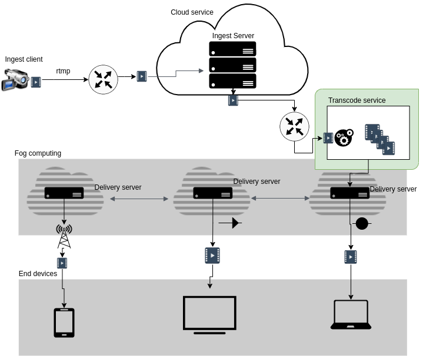

# Introduction

This module is a dash transcoding service to transcode the live representations to the delivery server.



# Dependencies

To build and run the server it is necessary to have Docker and docker-compose installed, see the links below to learn how to install them.

* Install Docker: https://docs.docker.com/engine/install/ubuntu/
* Install Docker-compose: https://docs.docker.com/compose/install/

# Volume Mapping

Before building the application, open the "docker-compose.yml" and configure the path that contains the mahimahi traces.

```bash
volumes:
      ...
      - ./traces:/traces
```

# The Environment settings

In the "config.yml" file, you can define the settings to this module.

```bash
ingest_server:
  server: 'rtmp://192.168.100.20' # ip ingest server
  port: "1936" # port rtmp ingest server
  channel: "live" 
  key: "veneza"

delivery_server:
  server: 'rtmp://192.168.100.20' # ip delivery server
  port: "1935"  # rtmp port delivery server
  channel: "dash" 
  key: "veneza" 

channel_to_ingest:
  mm_delay: "40"
  downlink: "/traces/12Mbps" #You can choose another trace available in the tracer folder
  uplink: "/traces/12Mbps"   # You can choose another trace available in the tracer folder

enviroment:
  timeout: "None" # None to no timeout or time in second
  log_level: "debug" # info or debug
  codec: "h264" # h264 or nvenc

dash_representation:
  representation: ['360p','540p','720p'] # See delivery server conf
  dash_variant: ['_low','_med','_high'] # That's is a suffix to the representation, see delivery server conf 
```

# Building and Running the transcode service

Make sure the Ingest Server module and the Delivery Server module are listening. To run the transcode service, enter into transcode_service_h264 folder and run:

$ sudo docker-compose up -d

# Stoping service

$ sudo docker-compose stop

# Watching a Live

Once Ingest Client is sending the stream it will be available over DASH and HLS. For DASH the URL will be http://<ip_delivery_server>/dash/<key>.mpd. Each streaming quality is available separately at http://<ip_delivery_server>/dash/<key>_<quality>/index.mpd, which is useful for checking each stream bitrate to ensure they're of acceptable quality. For HLS, the URL will be http://<ip_delivery_server>/hls/<key>.m3u8.
